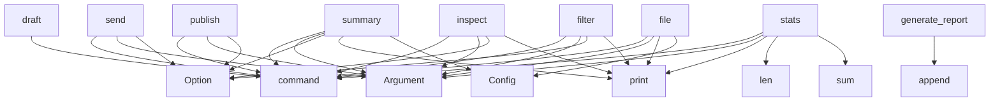

# System Architecture Analysis
<!-- generated in 0.00s -->

## Overview

- **Project**: /home/tom/github/semcod/tagi
- **Primary Language**: python
- **Languages**: python: 39, yaml: 2, txt: 1, shell: 1, toml: 1
- **Analysis Mode**: static
- **Total Functions**: 127
- **Total Classes**: 15
- **Modules**: 44
- **Entry Points**: 92

## Architecture by Module

### src.tagi.cli
- **Functions**: 19
- **File**: `cli.py`

### src.tagi.config
- **Functions**: 9
- **Classes**: 1
- **File**: `config.py`

### src.tagi.heuristics.metrics
- **Functions**: 9
- **File**: `metrics.py`

### src.tagi.providers.base
- **Functions**: 8
- **Classes**: 1
- **File**: `base.py`

### src.tagi.executor.git
- **Functions**: 8
- **Classes**: 1
- **File**: `git.py`

### src.tagi.composer.commit_message
- **Functions**: 7
- **File**: `commit_message.py`

### src.tagi.analyzer.metrics
- **Functions**: 6
- **Classes**: 1
- **File**: `metrics.py`

### src.tagi.planner.selector
- **Functions**: 5
- **File**: `selector.py`

### src.tagi.providers.gitlab
- **Functions**: 5
- **Classes**: 1
- **File**: `gitlab.py`

### src.tagi.providers.github
- **Functions**: 5
- **Classes**: 1
- **File**: `github.py`

### src.tagi.hooks
- **Functions**: 5
- **File**: `hooks.py`

### src.tagi.analyzer.dependency_graph
- **Functions**: 5
- **File**: `dependency_graph.py`

### src.tagi.llm.llx_adapter
- **Functions**: 4
- **Classes**: 1
- **File**: `llx_adapter.py`

### src.tagi.executor.publish
- **Functions**: 4
- **Classes**: 1
- **File**: `publish.py`

### src.tagi.planner.grouper
- **Functions**: 4
- **File**: `grouper.py`

### src.tagi.planner.sorter
- **Functions**: 3
- **File**: `sorter.py`

### src.tagi.heuristics.rules
- **Functions**: 3
- **File**: `rules.py`

### src.tagi.planner.preview
- **Functions**: 2
- **File**: `preview.py`

### src.tagi.scanner.status
- **Functions**: 2
- **File**: `status.py`

### src.tagi.scanner.diff
- **Functions**: 2
- **File**: `diff.py`

## Key Entry Points

Main execution flows into the system:

### src.tagi.cli.summary
> Generate a comprehensive summary report of all changes.
- **Calls**: app.command, typer.Argument, typer.Option, console.print, Config, report_lines.append, report_lines.append, report_lines.append

### src.tagi.cli.send
> Stage, commit, and optionally push changes.
- **Calls**: app.command, typer.Argument, typer.Option, typer.Option, typer.Option, typer.Option, typer.Option, sum

### src.tagi.cli.publish
> Create a PR or MR for the changes.
- **Calls**: app.command, typer.Argument, typer.Argument, typer.Option, typer.Option, console.print, src.tagi.cli._ensure_tag_prefix, sum

### src.tagi.cli.stats
> Show statistics about changes.
- **Calls**: app.command, typer.Argument, console.print, len, sum, Counter, Table, table.add_column

### src.tagi.cli.inspect
> Inspect a specific change group.
- **Calls**: app.command, typer.Argument, typer.Argument, typer.Option, console.print, Config, Tag, config.get_tag_description

### src.tagi.cli.filter
> Filter changes by tags.
- **Calls**: app.command, typer.Argument, typer.Argument, typer.Option, console.print, Config, console.print, src.tagi.cli._display_changes

### src.tagi.cli.file
> Show detailed information about a specific file.
- **Calls**: app.command, typer.Argument, typer.Argument, console.print, Config, Table, table.add_column, table.add_column

### src.tagi.analyzer.metrics.generate_report
> Generate a human-readable metrics report.

Args:
    metrics: Metrics dictionary
    
Returns:
    Formatted report string
- **Calls**: lines.append, lines.append, lines.append, lines.append, lines.append, lines.append, lines.append, lines.append

### src.tagi.cli.draft
> Draft a commit message for a change group.
- **Calls**: app.command, typer.Argument, typer.Argument, typer.Option, console.print, Tag, sum, ChangeGroup

### src.tagi.cli.scan
> Scan repository for uncommitted changes.
- **Calls**: app.command, typer.Argument, typer.Option, console.print, src.tagi.scanner.status.scan_repo, src.tagi.heuristics.tags.apply_tags, console.print, src.tagi.cli._display_changes_grouped

### src.tagi.cli.list_groups
> List available change groups.
- **Calls**: app.command, typer.Argument, console.print, src.tagi.cli._display_groups, Config, src.tagi.scanner.status.scan_repo, src.tagi.heuristics.tags.apply_tags, src.tagi.planner.grouper.group_changes

### src.tagi.composer.summary.generate_summary
> Generate a summary of changes.
- **Calls**: sum, lines.append, lines.append, sum, sum, sum, lines.append, None.join

### src.tagi.analyzer.dependency_graph.find_dependency_order
> Find the dependency order using topological sort.

Args:
    graph: Dependency graph mapping files to their dependencies
    
Returns:
    List of lis
- **Calls**: defaultdict, defaultdict, graph.items, deque, range, None.add, len, queue.popleft

### src.tagi.planner.branch_grouper.group_by_branch
> Group changes by the git branch they were modified on.

Args:
    changes: List of changes to group
    repo_path: Path to the git repository
    
Ret
- **Calls**: GitExecutor, executor.get_current_branch, None.append, subprocess.run, None.split, None.strip, result.stdout.strip, b.strip

### src.tagi.planner.preview.preview_changes
> Generate a preview for a change group.
- **Calls**: lines.append, lines.append, lines.append, lines.append, lines.append, None.join, None.join, lines.append

### src.tagi.analyzer.dependency_graph.get_critical_path
> Find the critical path (longest dependency chain).

Args:
    graph: Dependency graph mapping files to their dependencies
    
Returns:
    List of fi
- **Calls**: set, longest_path, path.append, visited.add, graph.get, graph.get, max, memo.get

### src.tagi.config.Config._load_config
> Load configuration from tagi.toml if it exists.
- **Calls**: Path, config_path.exists, print, open, tomli.load, None.get, None.get, print

### src.tagi.planner.preview.preview_plan
> Generate a preview of the execution plan.
- **Calls**: lines.append, lines.append, None.join, Tag, None.join, lines.append, len

### src.tagi.hooks.list_hooks
> List all git hooks in the repository.

Args:
    repo_path: Path to the git repository
    
Returns:
    List of hook names
- **Calls**: hooks_dir.iterdir, sorted, hooks_dir.exists, Path, hook_file.is_file, hooks.append, hook_file.stat

### src.tagi.analyzer.dependency_graph.detect_cycles
> Detect circular dependencies in the graph.

Args:
    graph: Dependency graph mapping files to their dependencies
    
Returns:
    List of cycles fou
- **Calls**: path.append, graph.get, path.pop, path.index, cycles.append, dfs, dfs

### src.tagi.planner.sorter.group_by_complexity
> Group changes into complexity tiers (simple, medium, complex).

Args:
    changes: List of changes to group
    num_groups: Number of complexity group
- **Calls**: src.tagi.planner.sorter.sort_by_complexity, max, range, len, len, len, groups.append

### src.tagi.composer.summary.generate_file_list
> Generate a formatted list of files.
- **Calls**: None.join, None.join, lines.append, len, lines.append, len

### src.tagi.analyzer.metrics.MetricsCollector.collect
> Collect metrics from changes.

Args:
    changes: List of changes to analyze
    
Returns:
    Dictionary of collected metrics
- **Calls**: len, sum, sum, len, None.get, None.get

### src.tagi.planner.branch_grouper.get_branch_info
> Get information about all branches in the repository.

Args:
    repo_path: Path to the git repository
    
Returns:
    Dictionary mapping branch nam
- **Calls**: subprocess.run, None.split, None.strip, result.stdout.strip, None.replace, line.strip

### src.tagi.hooks.run_hook
> Run a specific git hook.

Args:
    hook_name: Name of the hook to run (e.g., "pre-commit")
    repo_path: Path to the git repository
    
Returns:
  
- **Calls**: subprocess.run, hook_file.exists, FileNotFoundError, Path, str

### src.tagi.heuristics.metrics.calculate_vector_distance
> Calculate Euclidean distance between two change vectors.

Args:
    change1: First change
    change2: Second change
    
Returns:
    Euclidean dista
- **Calls**: change1.metrics.to_vector, change2.metrics.to_vector, math.sqrt, sum, zip

### src.tagi.config.Config.get_heuristics_for_path
> Get custom heuristic tags for a file path.
- **Calls**: path.lower, self.custom_heuristics.items, pattern.lower, tags.extend

### src.tagi.providers.gitlab.GitLabProvider.create_pr
> Create a merge request using glab CLI.
- **Calls**: self._run_command, cmd.append, cmd.extend, None.join

### src.tagi.providers.github.GitHubProvider.create_pr
> Create a pull request using gh CLI.
- **Calls**: self._run_command, cmd.append, cmd.extend, None.join

### src.tagi.cli.setup_logging
> Set up logging for all commands.
- **Calls**: app.callback, typer.Option, src.tagi.utils.logger.setup_logger, logger.debug

## Process Flows

Key execution flows identified:

### Flow 1: summary
```
summary [src.tagi.cli]
```

### Flow 2: send
```
send [src.tagi.cli]
```

### Flow 3: publish
```
publish [src.tagi.cli]
```

### Flow 4: stats
```
stats [src.tagi.cli]
```

### Flow 5: inspect
```
inspect [src.tagi.cli]
```

### Flow 6: filter
```
filter [src.tagi.cli]
```

### Flow 7: file
```
file [src.tagi.cli]
```

### Flow 8: generate_report
```
generate_report [src.tagi.analyzer.metrics]
```

### Flow 9: draft
```
draft [src.tagi.cli]
```

### Flow 10: scan
```
scan [src.tagi.cli]
  └─ →> scan_repo
```

## Key Classes

### src.tagi.config.Config
> Configuration loaded from tagi.toml.
- **Methods**: 9
- **Key Methods**: src.tagi.config.Config.__init__, src.tagi.config.Config._load_config, src.tagi.config.Config.get_tag_for_path, src.tagi.config.Config.get_custom_tags_for_pattern, src.tagi.config.Config.get_tag_color, src.tagi.config.Config.get_heuristics_for_path, src.tagi.config.Config.get_tag_description, src.tagi.config.Config.get_template, src.tagi.config.Config.should_ignore

### src.tagi.providers.base.BaseProvider
> Base class for Git hosting providers.
- **Methods**: 8
- **Key Methods**: src.tagi.providers.base.BaseProvider.__init__, src.tagi.providers.base.BaseProvider.is_authenticated, src.tagi.providers.base.BaseProvider.get_auth_status, src.tagi.providers.base.BaseProvider.create_pr, src.tagi.providers.base.BaseProvider.detect_remote, src.tagi.providers.base.BaseProvider._run_command, src.tagi.providers.base.BaseProvider._get_git_remote_url, src.tagi.providers.base.BaseProvider._check_git_remote_for_provider
- **Inherits**: ABC

### src.tagi.executor.git.GitExecutor
> Executor for git commands.
- **Methods**: 8
- **Key Methods**: src.tagi.executor.git.GitExecutor.__init__, src.tagi.executor.git.GitExecutor.add, src.tagi.executor.git.GitExecutor.commit, src.tagi.executor.git.GitExecutor.push, src.tagi.executor.git.GitExecutor.status, src.tagi.executor.git.GitExecutor.get_current_branch, src.tagi.executor.git.GitExecutor.get_remote_url, src.tagi.executor.git.GitExecutor.has_staged_changes

### src.tagi.providers.gitlab.GitLabProvider
> GitLab provider using glab CLI.
- **Methods**: 5
- **Key Methods**: src.tagi.providers.gitlab.GitLabProvider.is_authenticated, src.tagi.providers.gitlab.GitLabProvider.get_auth_status, src.tagi.providers.gitlab.GitLabProvider.get_configured_host, src.tagi.providers.gitlab.GitLabProvider.create_pr, src.tagi.providers.gitlab.GitLabProvider.detect_remote
- **Inherits**: BaseProvider

### src.tagi.providers.github.GitHubProvider
> GitHub provider using gh CLI.
- **Methods**: 5
- **Key Methods**: src.tagi.providers.github.GitHubProvider.is_authenticated, src.tagi.providers.github.GitHubProvider.get_auth_status, src.tagi.providers.github.GitHubProvider.get_token, src.tagi.providers.github.GitHubProvider.create_pr, src.tagi.providers.github.GitHubProvider.detect_remote
- **Inherits**: BaseProvider

### src.tagi.llm.llx_adapter.LlxAdapter
> Adapter for LLX library for optional LLM integration.
- **Methods**: 4
- **Key Methods**: src.tagi.llm.llx_adapter.LlxAdapter.__init__, src.tagi.llm.llx_adapter.LlxAdapter.is_available, src.tagi.llm.llx_adapter.LlxAdapter.improve_message, src.tagi.llm.llx_adapter.LlxAdapter.improve_description

### src.tagi.executor.publish.PublishExecutor
> Executor for publishing changes.
- **Methods**: 4
- **Key Methods**: src.tagi.executor.publish.PublishExecutor.__init__, src.tagi.executor.publish.PublishExecutor.stage_and_commit, src.tagi.executor.publish.PublishExecutor.publish, src.tagi.executor.publish.PublishExecutor.dry_run

### src.tagi.analyzer.metrics.MetricsCollector
> Collect and analyze metrics about changes.
- **Methods**: 4
- **Key Methods**: src.tagi.analyzer.metrics.MetricsCollector.__init__, src.tagi.analyzer.metrics.MetricsCollector.collect, src.tagi.analyzer.metrics.MetricsCollector.to_json, src.tagi.analyzer.metrics.MetricsCollector.save

### src.tagi.models.change.ChangeMetrics
> Numerical metrics for change analysis.
- **Methods**: 1
- **Key Methods**: src.tagi.models.change.ChangeMetrics.to_vector

### src.tagi.models.plan.PlanStep
> A single step in an execution plan.
- **Methods**: 0

### src.tagi.models.plan.Plan
> An execution plan for shipping changes.
- **Methods**: 0

### src.tagi.models.group.ChangeGroup
> Group of related changes.
- **Methods**: 0

### src.tagi.models.change.ChangeType
> Type of git change.
- **Methods**: 0
- **Inherits**: str, Enum

### src.tagi.models.change.Tag
> Hashtag categories for changes.
- **Methods**: 0
- **Inherits**: str, Enum

### src.tagi.models.change.Change
> Represents a single file change.
- **Methods**: 0

## Data Transformation Functions

Key functions that process and transform data:

### src.tagi.scanner.status.parse_status
> Parse git status code to ChangeType.

### src.tagi.cli._format_tags
> Format tags with color coding.
- **Output to**: None.join, formatted.append, config.get_tag_color, tag_colors.get

## Public API Surface

Functions exposed as public API (no underscore prefix):

- `src.tagi.cli.summary` - 55 calls
- `src.tagi.cli.send` - 47 calls
- `src.tagi.cli.publish` - 45 calls
- `src.tagi.cli.stats` - 43 calls
- `src.tagi.cli.inspect` - 42 calls
- `src.tagi.cli.filter` - 28 calls
- `src.tagi.cli.file` - 26 calls
- `src.tagi.analyzer.metrics.generate_report` - 23 calls
- `src.tagi.cli.draft` - 22 calls
- `src.tagi.heuristics.tags.apply_tags` - 16 calls
- `src.tagi.scanner.status.scan_repo` - 15 calls
- `src.tagi.cli.scan` - 15 calls
- `src.tagi.utils.logger.setup_logger` - 15 calls
- `src.tagi.cli.list_groups` - 13 calls
- `src.tagi.composer.commit_message.generate_commit_message` - 12 calls
- `src.tagi.composer.commit_message.generate_detailed_message` - 12 calls
- `src.tagi.composer.summary.generate_summary` - 11 calls
- `src.tagi.analyzer.dependency_graph.find_dependency_order` - 11 calls
- `src.tagi.planner.grouper.group_changes` - 11 calls
- `src.tagi.planner.branch_grouper.group_by_branch` - 10 calls
- `src.tagi.planner.preview.preview_changes` - 9 calls
- `src.tagi.analyzer.dependency_graph.get_critical_path` - 9 calls
- `src.tagi.analyzer.dependency_graph.analyze_python_imports` - 8 calls
- `src.tagi.planner.preview.preview_plan` - 7 calls
- `src.tagi.scanner.files.count_lines_changed` - 7 calls
- `src.tagi.hooks.list_hooks` - 7 calls
- `src.tagi.analyzer.dependency_graph.detect_cycles` - 7 calls
- `src.tagi.planner.sorter.group_by_complexity` - 7 calls
- `src.tagi.composer.summary.generate_file_list` - 6 calls
- `src.tagi.analyzer.metrics.MetricsCollector.collect` - 6 calls
- `src.tagi.planner.branch_grouper.get_branch_info` - 6 calls
- `src.tagi.heuristics.metrics.calculate_metrics` - 6 calls
- `src.tagi.composer.commit_message.generate_files_message` - 6 calls
- `src.tagi.cli.create_pr` - 5 calls
- `src.tagi.cli.create_mr` - 5 calls
- `src.tagi.hooks.run_hook` - 5 calls
- `src.tagi.heuristics.metrics.calculate_vector_distance` - 5 calls
- `src.tagi.config.Config.get_heuristics_for_path` - 4 calls
- `src.tagi.providers.gitlab.GitLabProvider.create_pr` - 4 calls
- `src.tagi.providers.github.GitHubProvider.create_pr` - 4 calls

## System Interactions

How components interact:



## Reverse Engineering Guidelines

1. **Entry Points**: Start analysis from the entry points listed above
2. **Core Logic**: Focus on classes with many methods
3. **Data Flow**: Follow data transformation functions
4. **Process Flows**: Use the flow diagrams for execution paths
5. **API Surface**: Public API functions reveal the interface

## Context for LLM

Maintain the identified architectural patterns and public API surface when suggesting changes.