# System Architecture Analysis
<!-- generated in 0.00s -->

## Overview

- **Project**: /home/tom/github/semcod/tagi
- **Primary Language**: python
- **Languages**: python: 64, yaml: 5, txt: 2, toml: 1, shell: 1
- **Analysis Mode**: static
- **Total Functions**: 193
- **Total Classes**: 26
- **Modules**: 73
- **Entry Points**: 133

## Architecture by Module

### src.tagi.config
- **Functions**: 10
- **Classes**: 1
- **File**: `config.py`

### src.tagi.providers.koru
- **Functions**: 10
- **Classes**: 2
- **File**: `koru.py`

### src.tagi.heuristics.metrics
- **Functions**: 9
- **File**: `metrics.py`

### src.tagi.providers.base
- **Functions**: 8
- **Classes**: 2
- **File**: `base.py`

### src.tagi.executor.git
- **Functions**: 8
- **Classes**: 1
- **File**: `git.py`

### src.tagi.hooks
- **Functions**: 7
- **File**: `hooks.py`

### src.tagi.cli.git_operations
- **Functions**: 7
- **File**: `git_operations.py`

### src.tagi.cli.main
- **Functions**: 7
- **File**: `main.py`

### src.tagi.analyzer.metrics
- **Functions**: 6
- **Classes**: 1
- **File**: `metrics.py`

### src.tagi.utils.inspect_helpers
- **Functions**: 6
- **File**: `inspect_helpers.py`

### src.tagi.analyzer.dependency_graph
- **Functions**: 5
- **File**: `dependency_graph.py`

### src.tagi.planner.selector
- **Functions**: 5
- **File**: `selector.py`

### src.tagi.cli.provider_commands
- **Functions**: 5
- **File**: `provider_commands.py`

### src.tagi.cli.core_commands
- **Functions**: 5
- **File**: `core_commands.py`

### src.tagi.cli.utility_commands
- **Functions**: 5
- **File**: `utility_commands.py`

### src.tagi.providers.gitlab
- **Functions**: 5
- **Classes**: 1
- **File**: `gitlab.py`

### src.tagi.providers.github
- **Functions**: 5
- **Classes**: 1
- **File**: `github.py`

### src.tagi.composer.formats
- **Functions**: 5
- **File**: `formats.py`

### src.tagi.utils.summary_helpers
- **Functions**: 5
- **File**: `summary_helpers.py`

### src.tagi.planner.grouper
- **Functions**: 4
- **File**: `grouper.py`

## Key Entry Points

Main execution flows into the system:

### src.tagi.cli.publishing_commands.publish_command
> Create a PR or MR for the changes.
- **Calls**: typer.Argument, typer.Argument, typer.Option, typer.Option, typer.Option, _cli._configure_command_logging, console.print, src.tagi.cli.scan_utils.scan_and_tag

### src.tagi.cli.utility_commands.summary_command
> Generate a comprehensive summary report of all changes.
- **Calls**: typer.Argument, typer.Option, console.print, src.tagi.cli.scan_utils.scan_and_tag, summary_lines.append, summary_lines.append, summary_lines.append, summary_lines.append

### src.tagi.cli.utility_commands.hooks_command
> Manage git hooks integration for tagi.
- **Calls**: typer.Argument, typer.Option, typer.Option, typer.Option, None.resolve, src.tagi.hooks.check_hooks_installed, tagi_list_hooks, tagi_install_hooks

### src.tagi.analyzer.metrics.generate_report
> Generate a human-readable metrics report.

Args:
    metrics: Metrics dictionary
    
Returns:
    Formatted report string
- **Calls**: LineBuilder, builder.add, builder.add, builder.add, builder.add, builder.add, builder.add, builder.add

### src.tagi.cli.publishing_commands.deploy_command
> Deploy changes to target environment.
- **Calls**: typer.Argument, typer.Argument, typer.Option, typer.Option, typer.Option, _cli._configure_command_logging, console.print, src.tagi.cli.scan_utils.scan_and_tag

### src.tagi.cli.inspection_commands.inspect_command
> Inspect a specific change group.
- **Calls**: typer.Argument, typer.Argument, typer.Option, console.print, src.tagi.config.load_config, src.tagi.utils.inspect_helpers.resolve_filtered_changes, config.get_tag_description, src.tagi.utils.inspect_helpers.display_statistics_table

### src.tagi.cli.utility_commands.draft_command
> Draft a commit message for a change group.
- **Calls**: typer.Argument, typer.Argument, typer.Option, console.print, src.tagi.cli.scan_utils.scan_and_tag, src.tagi.cli.utility_commands._ensure_tag_prefix, src.tagi.utils.send_helpers.create_change_group, src.tagi.composer.commit_message.generate_commit_message

### src.tagi.cli.inspection_commands.filter_command
> Filter changes by tags.
- **Calls**: typer.Argument, typer.Argument, typer.Option, typer.Option, console.print, src.tagi.utils.inspect_helpers.resolve_filtered_changes, src.tagi.utils.inspect_helpers.display_statistics_table, src.tagi.cli.display_utils._display_changes

### src.tagi.heuristics.tags.apply_tags
> Apply heuristic tags to changes.
- **Calls**: src.tagi.config.load_config, config.get_tag_for_path, config.get_heuristics_for_path, src.tagi.scanner.files.count_lines_changed, tags.extend, src.tagi.heuristics.metrics.calculate_metrics, src.tagi.heuristics.scoring.calculate_risk_score, src.tagi.heuristics.tags.apply_path_tags

### src.tagi.cli.core_commands.stats_command
> Show statistics about changes.
- **Calls**: typer.Argument, typer.Option, console.print, src.tagi.cli.scan_utils.scan_and_tag, src.tagi.utils.inspect_helpers.display_statistics_table, console.print, console.print, src.tagi.utils.inspect_helpers.calculate_tag_statistics

### src.tagi.scanner.status.scan_repo
> Scan repository for uncommitted changes using git status --porcelain.
- **Calls**: src.tagi.config.load_config, subprocess.run, None.split, os.path.exists, ValueError, RuntimeError, line.split, None.strip

### src.tagi.cli.inspection_commands.file_command
> Show detailed information about a specific file.
- **Calls**: typer.Argument, typer.Argument, typer.Option, console.print, console.print, console.print, console.print, None.join

### src.tagi.ui.design_tokens.DesignTokens.get_css_variables
> Get CSS variables for specified theme.
- **Calls**: variables.update, variables.update, variables.update, variables.update, variables.update, variables.update, variables.update, str

### src.tagi.cli.utility_commands.init_command
> Initialize tagi configuration in the repository.
- **Calls**: typer.Argument, typer.Option, None.resolve, console.print, config_path.exists, console.print, console.print, example_path.exists

### src.tagi.composer.formats.generate_detailed_message
> Generate a detailed commit message.
- **Calls**: LineBuilder, builder.add, builder.add, Counter, builder.add, tag_counts.most_common, builder.add, builder.add

### src.tagi.analyzer.dependency_graph.find_dependency_order
> Find the dependency order using topological sort.

Args:
    graph: Dependency graph mapping files to their dependencies
    
Returns:
    List of lis
- **Calls**: defaultdict, defaultdict, graph.items, deque, range, None.add, len, queue.popleft

### src.tagi.composer.summary.generate_summary
> Generate a summary of changes.
- **Calls**: sum, src.tagi.utils.risk.average_risk, LineBuilder, builder.add, builder.add, sum, sum, sum

### src.tagi.planner.grouper.group_changes
> Group changes by their primary tag.
- **Calls**: defaultdict, grouped.items, sorted, sum, src.tagi.utils.risk.average_risk, ChangeGroup, groups.append, src.tagi.planner.grouper._get_primary_tag

### src.tagi.planner.preview.preview_changes
> Generate a preview for a change group.
- **Calls**: LineBuilder, builder.add, builder.add, builder.add, builder.add, builder.add, builder.text, None.join

### src.tagi.planner.branch_grouper.group_by_branch
> Group changes by the git branch they were modified on.

Args:
    changes: List of changes to group
    repo_path: Path to the git repository
    
Ret
- **Calls**: GitExecutor, executor.get_current_branch, None.append, subprocess.run, None.split, None.strip, result.stdout.strip, b.strip

### src.tagi.providers.koru.KoruProvider.analyze_deployment_priority
> Analyze deployment priority using Koru API.
- **Calls**: self.get_topology, self.get_planfile_tickets, self.get_context_brief, self.run_quality_gates, self._deployment_recommendations, KoruDeploymentPlan, deployment_groups.append, priority_order.append

### src.tagi.utils.summary_helpers.build_statistics_section
> Build overall statistics section.

Args:
    changes: All changes
    
Returns:
    List of statistics lines
- **Calls**: sum, src.tagi.utils.risk.average_risk, LineBuilder, builder.add, builder.add, builder.add, builder.add, builder.add

### src.tagi.utils.summary_helpers.build_tag_distribution_section
> Build tag distribution section.

Args:
    changes: All changes
    config: Configuration instance
    
Returns:
    List of tag distribution lines
- **Calls**: Counter, LineBuilder, builder.add, builder.add, tag_counts.most_common, builder.add, builder.as_list, config.get_tag_description

### src.tagi.analyzer.dependency_graph.get_critical_path
> Find the critical path (longest dependency chain).

Args:
    graph: Dependency graph mapping files to their dependencies
    
Returns:
    List of fi
- **Calls**: set, longest_path, path.append, visited.add, graph.get, graph.get, max, memo.get

### src.tagi.providers.koru.KoruProvider._deployment_recommendations
> Generate recommendations based on Koru context.
- **Calls**: quality_gates.get, topology.get, recommendations.append, recommendations.append, recommendations.append, recommendations.append, recommendations.append, len

### src.tagi.utils.summary_helpers.build_report_header
> Build report header section.

Args:
    repo_path: Repository path
    changes: All changes
    
Returns:
    List of header lines
- **Calls**: LineBuilder, builder.add, builder.add, builder.add, builder.add, builder.add, builder.add, builder.as_list

### src.tagi.utils.summary_helpers.build_changes_by_type_section
> Build changes by type section.

Args:
    changes: All changes
    
Returns:
    List of type distribution lines
- **Calls**: Counter, LineBuilder, builder.add, builder.add, sorted, builder.add, builder.as_list, by_type.items

### src.tagi.config.Config._load_config
> Load configuration from tagi.toml if it exists.
- **Calls**: Path, config_path.exists, print, open, tomli.load, None.get, None.get, print

### src.tagi.planner.preview.preview_plan
> Generate a preview of the execution plan.
- **Calls**: LineBuilder, builder.add, builder.add, builder.text, Tag, None.join, builder.add, len

### src.tagi.cli.git_operations.auto_command
> Automatically scan, order, and send all changes.
- **Calls**: typer.Argument, typer.Option, typer.Option, typer.Option, typer.Option, src.tagi.cli.main._configure_command_logging, console.print, src.tagi.cli.git_operations.send_command

## Process Flows

Key execution flows identified:

### Flow 1: publish_command
```
publish_command [src.tagi.cli.publishing_commands]
```

### Flow 2: summary_command
```
summary_command [src.tagi.cli.utility_commands]
  └─ →> scan_and_tag
```

### Flow 3: hooks_command
```
hooks_command [src.tagi.cli.utility_commands]
```

### Flow 4: generate_report
```
generate_report [src.tagi.analyzer.metrics]
```

### Flow 5: deploy_command
```
deploy_command [src.tagi.cli.publishing_commands]
```

### Flow 6: inspect_command
```
inspect_command [src.tagi.cli.inspection_commands]
  └─ →> load_config
```

### Flow 7: draft_command
```
draft_command [src.tagi.cli.utility_commands]
  └─ →> scan_and_tag
```

### Flow 8: filter_command
```
filter_command [src.tagi.cli.inspection_commands]
```

### Flow 9: apply_tags
```
apply_tags [src.tagi.heuristics.tags]
  └─ →> load_config
  └─ →> count_lines_changed
```

### Flow 10: stats_command
```
stats_command [src.tagi.cli.core_commands]
  └─ →> scan_and_tag
  └─ →> display_statistics_table
      └─> calculate_tag_statistics
          └─ →> average_risk
```

## Key Classes

### src.tagi.providers.koru.KoruProvider
> Integration with Koru API for deployment analysis.
- **Methods**: 10
- **Key Methods**: src.tagi.providers.koru.KoruProvider.__init__, src.tagi.providers.koru.KoruProvider._make_api_request, src.tagi.providers.koru.KoruProvider.get_topology, src.tagi.providers.koru.KoruProvider.get_planfile_tickets, src.tagi.providers.koru.KoruProvider.run_quality_gates, src.tagi.providers.koru.KoruProvider.get_context_brief, src.tagi.providers.koru.KoruProvider._deployment_recommendations, src.tagi.providers.koru.KoruProvider.analyze_deployment_priority, src.tagi.providers.koru.KoruProvider.deploy_group, src.tagi.providers.koru.KoruProvider.is_available

### src.tagi.config.Config
> Configuration loaded from tagi.toml.
- **Methods**: 9
- **Key Methods**: src.tagi.config.Config.__init__, src.tagi.config.Config._load_config, src.tagi.config.Config.get_tag_for_path, src.tagi.config.Config.get_custom_tags_for_pattern, src.tagi.config.Config.get_tag_color, src.tagi.config.Config.get_heuristics_for_path, src.tagi.config.Config.get_tag_description, src.tagi.config.Config.get_template, src.tagi.config.Config.should_ignore

### src.tagi.providers.base.BaseProvider
> Base class for Git hosting providers.
- **Methods**: 8
- **Key Methods**: src.tagi.providers.base.BaseProvider.__init__, src.tagi.providers.base.BaseProvider.is_authenticated, src.tagi.providers.base.BaseProvider.get_auth_status, src.tagi.providers.base.BaseProvider.create_pr, src.tagi.providers.base.BaseProvider.detect_remote, src.tagi.providers.base.BaseProvider._run_command, src.tagi.providers.base.BaseProvider._get_git_remote_url, src.tagi.providers.base.BaseProvider._check_git_remote_for_provider
- **Inherits**: ABC

### src.tagi.executor.git.GitExecutor
> Executor for git commands.
- **Methods**: 8
- **Key Methods**: src.tagi.executor.git.GitExecutor.__init__, src.tagi.executor.git.GitExecutor.add, src.tagi.executor.git.GitExecutor.commit, src.tagi.executor.git.GitExecutor.push, src.tagi.executor.git.GitExecutor.status, src.tagi.executor.git.GitExecutor.get_current_branch, src.tagi.executor.git.GitExecutor.get_remote_url, src.tagi.executor.git.GitExecutor.has_staged_changes

### src.tagi.providers.gitlab.GitLabProvider
> GitLab provider using glab CLI.
- **Methods**: 5
- **Key Methods**: src.tagi.providers.gitlab.GitLabProvider.is_authenticated, src.tagi.providers.gitlab.GitLabProvider.get_auth_status, src.tagi.providers.gitlab.GitLabProvider.get_configured_host, src.tagi.providers.gitlab.GitLabProvider.create_pr, src.tagi.providers.gitlab.GitLabProvider.detect_remote
- **Inherits**: BaseProvider

### src.tagi.providers.github.GitHubProvider
> GitHub provider using gh CLI.
- **Methods**: 5
- **Key Methods**: src.tagi.providers.github.GitHubProvider.is_authenticated, src.tagi.providers.github.GitHubProvider.get_auth_status, src.tagi.providers.github.GitHubProvider.get_token, src.tagi.providers.github.GitHubProvider.create_pr, src.tagi.providers.github.GitHubProvider.detect_remote
- **Inherits**: BaseProvider

### src.tagi.analyzer.metrics.MetricsCollector
> Collect and analyze metrics about changes.
- **Methods**: 4
- **Key Methods**: src.tagi.analyzer.metrics.MetricsCollector.__init__, src.tagi.analyzer.metrics.MetricsCollector.collect, src.tagi.analyzer.metrics.MetricsCollector.to_json, src.tagi.analyzer.metrics.MetricsCollector.save

### src.tagi.llm.llx_adapter.LlxAdapter
> Adapter for LLX library for optional LLM integration.
- **Methods**: 4
- **Key Methods**: src.tagi.llm.llx_adapter.LlxAdapter.__init__, src.tagi.llm.llx_adapter.LlxAdapter.is_available, src.tagi.llm.llx_adapter.LlxAdapter.improve_message, src.tagi.llm.llx_adapter.LlxAdapter.improve_description

### src.tagi.executor.publish.PublishExecutor
> Executor for publishing changes.
- **Methods**: 4
- **Key Methods**: src.tagi.executor.publish.PublishExecutor.__init__, src.tagi.executor.publish.PublishExecutor.stage_and_commit, src.tagi.executor.publish.PublishExecutor.publish, src.tagi.executor.publish.PublishExecutor.dry_run

### src.tagi.utils.line_builder.LineBuilder
> Single place where report line lists are created and mutated.
- **Methods**: 4
- **Key Methods**: src.tagi.utils.line_builder.LineBuilder.__init__, src.tagi.utils.line_builder.LineBuilder.add, src.tagi.utils.line_builder.LineBuilder.as_list, src.tagi.utils.line_builder.LineBuilder.text

### src.tagi.ui.design_tokens.DesignTokens
> Main design tokens container.
- **Methods**: 3
- **Key Methods**: src.tagi.ui.design_tokens.DesignTokens.__init__, src.tagi.ui.design_tokens.DesignTokens.get_css_variables, src.tagi.ui.design_tokens.DesignTokens.get_css_string

### src.tagi.models.change.ChangeMetrics
> Numerical metrics for change analysis.
- **Methods**: 1
- **Key Methods**: src.tagi.models.change.ChangeMetrics.to_vector

### src.tagi.models.plan.PlanStep
> A single step in an execution plan.
- **Methods**: 0

### src.tagi.models.plan.Plan
> An execution plan for shipping changes.
- **Methods**: 0

### src.tagi.models.change.ChangeType
> Type of git change.
- **Methods**: 0
- **Inherits**: str, Enum

### src.tagi.models.change.Tag
> Hashtag categories for changes.
- **Methods**: 0
- **Inherits**: str, Enum

### src.tagi.models.change.Change
> Represents a single file change.
- **Methods**: 0

### src.tagi.models.group.ChangeGroup
> Group of related changes.
- **Methods**: 0

### src.tagi.providers.base.PrSpec
> Pull/merge request parameters.
- **Methods**: 0

### src.tagi.providers.koru.KoruDeploymentPlan
> Deployment plan from Koru API.
- **Methods**: 0

## Data Transformation Functions

Key functions that process and transform data:

### src.tagi.cli.display_utils._format_tags
> Format tags for display with descriptions if available.
- **Output to**: None.join, tag_strings.append, config.get_tag_description

### src.tagi.scanner.status.parse_status
> Parse git status code to ChangeType.

## Public API Surface

Functions exposed as public API (no underscore prefix):

- `src.tagi.cli.publishing_commands.publish_command` - 36 calls
- `src.tagi.cli.utility_commands.summary_command` - 28 calls
- `src.tagi.cli.git_operations.send_command` - 26 calls
- `src.tagi.cli.utility_commands.hooks_command` - 26 calls
- `src.tagi.analyzer.metrics.generate_report` - 24 calls
- `src.tagi.cli.publishing_commands.deploy_command` - 22 calls
- `src.tagi.cli.inspection_commands.inspect_command` - 17 calls
- `src.tagi.cli.utility_commands.draft_command` - 17 calls
- `src.tagi.cli.inspection_commands.filter_command` - 16 calls
- `src.tagi.heuristics.tags.apply_tags` - 16 calls
- `src.tagi.cli.core_commands.stats_command` - 15 calls
- `src.tagi.scanner.status.scan_repo` - 15 calls
- `src.tagi.utils.logger.setup_logger` - 15 calls
- `src.tagi.cli.inspection_commands.file_command` - 14 calls
- `src.tagi.ui.design_tokens.DesignTokens.get_css_variables` - 14 calls
- `src.tagi.cli.utility_commands.init_command` - 13 calls
- `src.tagi.composer.formats.generate_detailed_message` - 13 calls
- `src.tagi.analyzer.dependency_graph.find_dependency_order` - 11 calls
- `src.tagi.composer.summary.generate_summary` - 11 calls
- `src.tagi.utils.inspect_helpers.display_statistics_table` - 11 calls
- `src.tagi.planner.grouper.group_changes` - 10 calls
- `src.tagi.planner.preview.preview_changes` - 10 calls
- `src.tagi.planner.branch_grouper.group_by_branch` - 10 calls
- `src.tagi.providers.koru.KoruProvider.analyze_deployment_priority` - 10 calls
- `src.tagi.utils.summary_helpers.build_statistics_section` - 10 calls
- `src.tagi.utils.summary_helpers.build_tag_distribution_section` - 10 calls
- `src.tagi.analyzer.dependency_graph.get_critical_path` - 9 calls
- `src.tagi.utils.summary_helpers.build_report_header` - 9 calls
- `src.tagi.utils.summary_helpers.build_changes_by_type_section` - 9 calls
- `src.tagi.analyzer.dependency_graph.analyze_python_imports` - 8 calls
- `src.tagi.planner.preview.preview_plan` - 8 calls
- `src.tagi.cli.git_operations.auto_command` - 8 calls
- `src.tagi.cli.provider_commands.create_pr` - 8 calls
- `src.tagi.cli.provider_commands.create_mr` - 8 calls
- `src.tagi.utils.inspect_helpers.resolve_filtered_changes` - 8 calls
- `src.tagi.hooks.list_hooks` - 7 calls
- `src.tagi.analyzer.dependency_graph.detect_cycles` - 7 calls
- `src.tagi.planner.sorter.group_by_complexity` - 7 calls
- `src.tagi.cli.core_commands.scan_command` - 7 calls
- `src.tagi.scanner.files.count_lines_changed` - 7 calls

## System Interactions

How components interact:

```mermaid
graph TD
    publish_command --> Argument
    publish_command --> Option
    summary_command --> Argument
    summary_command --> Option
    summary_command --> print
    summary_command --> scan_and_tag
    summary_command --> append
    hooks_command --> Argument
    hooks_command --> Option
    hooks_command --> resolve
    generate_report --> LineBuilder
    generate_report --> add
    deploy_command --> Argument
    deploy_command --> Option
    inspect_command --> Argument
    inspect_command --> Option
    inspect_command --> print
    inspect_command --> load_config
    draft_command --> Argument
    draft_command --> Option
    draft_command --> print
    draft_command --> scan_and_tag
    filter_command --> Argument
    filter_command --> Option
    filter_command --> print
    apply_tags --> load_config
    apply_tags --> get_tag_for_path
    apply_tags --> get_heuristics_for_p
    apply_tags --> count_lines_changed
    apply_tags --> extend
```



## Reverse Engineering Guidelines

1. **Entry Points**: Start analysis from the entry points listed above
2. **Core Logic**: Focus on classes with many methods
3. **Data Flow**: Follow data transformation functions
4. **Process Flows**: Use the flow diagrams for execution paths
5. **API Surface**: Public API functions reveal the interface

## Context for LLM

Maintain the identified architectural patterns and public API surface when suggesting changes.