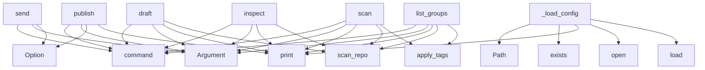

# System Architecture Analysis
<!-- generated in 0.00s -->

## Overview

- **Project**: /home/tom/github/semcod/tagi
- **Primary Language**: python
- **Languages**: python: 10, shell: 2, yaml: 1, toml: 1
- **Analysis Mode**: static
- **Total Functions**: 26
- **Total Classes**: 5
- **Modules**: 14
- **Entry Points**: 10

## Architecture by Module

### src.tagi.cli
- **Functions**: 8
- **File**: `cli.py`

### src.tagi.config
- **Functions**: 4
- **Classes**: 1
- **File**: `config.py`

### src.tagi.providers
- **Functions**: 3
- **File**: `providers.py`

### src.tagi.executor
- **Functions**: 3
- **File**: `executor.py`

### src.tagi.heuristics
- **Functions**: 3
- **File**: `heuristics.py`

### src.tagi.composer
- **Functions**: 2
- **File**: `composer.py`

### src.tagi.scanner
- **Functions**: 2
- **File**: `scanner.py`

### src.tagi.planner
- **Functions**: 1
- **File**: `planner.py`

### src.tagi.models
- **Functions**: 0
- **Classes**: 4
- **File**: `models.py`

## Key Entry Points

Main execution flows into the system:

### src.tagi.cli.publish
> Create a PR or MR for the changes.
- **Calls**: app.command, typer.Argument, typer.Argument, typer.Option, console.print, src.tagi.scanner.scan_repo, src.tagi.heuristics.apply_tags, src.tagi.planner.group_changes

### src.tagi.cli.send
> Stage, commit, and optionally push changes.
- **Calls**: app.command, typer.Argument, typer.Argument, typer.Option, typer.Option, console.print, src.tagi.scanner.scan_repo, src.tagi.heuristics.apply_tags

### src.tagi.cli.draft
> Draft a commit message for a change group.
- **Calls**: app.command, typer.Argument, typer.Argument, console.print, src.tagi.scanner.scan_repo, src.tagi.heuristics.apply_tags, src.tagi.planner.group_changes, Tag

### src.tagi.cli.scan
> Scan repository for uncommitted changes.
- **Calls**: app.command, typer.Argument, console.print, src.tagi.scanner.scan_repo, src.tagi.heuristics.apply_tags, src.tagi.cli._display_changes, os.path.exists, console.print

### src.tagi.cli.inspect
> Inspect a specific change group.
- **Calls**: app.command, typer.Argument, typer.Argument, console.print, src.tagi.scanner.scan_repo, src.tagi.heuristics.apply_tags, Tag, src.tagi.cli._display_changes

### src.tagi.cli.list_groups
> List available change groups.
- **Calls**: app.command, typer.Argument, console.print, src.tagi.scanner.scan_repo, src.tagi.heuristics.apply_tags, src.tagi.planner.group_changes, src.tagi.cli._display_groups, console.print

### src.tagi.config.Config._load_config
> Load configuration from tagi.toml if it exists.
- **Calls**: Path, config_path.exists, print, open, tomli.load, print

### src.tagi.config.Config.get_tag_for_path
> Get custom tag for a file path based on rules.
- **Calls**: path.lower, self.custom_rules.items, pattern.lower

### src.tagi.config.Config.__init__
- **Calls**: self._load_config

### src.tagi.config.Config.get_custom_tags_for_pattern
> Get custom tags for a pattern.
- **Calls**: self.custom_tags.get

## Process Flows

Key execution flows identified:

### Flow 1: publish
```
publish [src.tagi.cli]
```

### Flow 2: send
```
send [src.tagi.cli]
```

### Flow 3: draft
```
draft [src.tagi.cli]
  └─ →> scan_repo
      └─> _parse_status
```

### Flow 4: scan
```
scan [src.tagi.cli]
  └─ →> scan_repo
      └─> _parse_status
  └─ →> apply_tags
      └─> _count_lines_changed
```

### Flow 5: inspect
```
inspect [src.tagi.cli]
  └─ →> scan_repo
      └─> _parse_status
```

### Flow 6: list_groups
```
list_groups [src.tagi.cli]
  └─ →> scan_repo
      └─> _parse_status
  └─ →> apply_tags
      └─> _count_lines_changed
```

### Flow 7: _load_config
```
_load_config [src.tagi.config.Config]
```

### Flow 8: get_tag_for_path
```
get_tag_for_path [src.tagi.config.Config]
```

### Flow 9: __init__
```
__init__ [src.tagi.config.Config]
```

### Flow 10: get_custom_tags_for_pattern
```
get_custom_tags_for_pattern [src.tagi.config.Config]
```

## Key Classes

### src.tagi.config.Config
> Configuration loaded from tagi.toml.
- **Methods**: 4
- **Key Methods**: src.tagi.config.Config.__init__, src.tagi.config.Config._load_config, src.tagi.config.Config.get_tag_for_path, src.tagi.config.Config.get_custom_tags_for_pattern

### src.tagi.models.ChangeType
> Type of git change.
- **Methods**: 0
- **Inherits**: str, Enum

### src.tagi.models.Tag
> Hashtag categories for changes.
- **Methods**: 0
- **Inherits**: str, Enum

### src.tagi.models.Change
> Represents a single file change.
- **Methods**: 0

### src.tagi.models.ChangeGroup
> Group of related changes.
- **Methods**: 0

## Data Transformation Functions

Key functions that process and transform data:

### src.tagi.scanner._parse_status
> Parse git status code to ChangeType.

## Public API Surface

Functions exposed as public API (no underscore prefix):

- `src.tagi.cli.publish` - 34 calls
- `src.tagi.cli.send` - 32 calls
- `src.tagi.heuristics.apply_tags` - 27 calls
- `src.tagi.composer.generate_commit_message` - 18 calls
- `src.tagi.cli.draft` - 12 calls
- `src.tagi.cli.scan` - 11 calls
- `src.tagi.cli.inspect` - 9 calls
- `src.tagi.cli.list_groups` - 8 calls
- `src.tagi.planner.group_changes` - 8 calls
- `src.tagi.executor.stage_changes` - 7 calls
- `src.tagi.scanner.scan_repo` - 7 calls
- `src.tagi.providers.create_pr` - 5 calls
- `src.tagi.providers.create_mr` - 5 calls
- `src.tagi.executor.commit_changes` - 4 calls
- `src.tagi.config.Config.get_tag_for_path` - 3 calls
- `src.tagi.executor.push_changes` - 3 calls
- `src.tagi.config.Config.get_custom_tags_for_pattern` - 1 calls
- `src.tagi.providers.detect_provider` - 1 calls

## System Interactions

How components interact:



## Reverse Engineering Guidelines

1. **Entry Points**: Start analysis from the entry points listed above
2. **Core Logic**: Focus on classes with many methods
3. **Data Flow**: Follow data transformation functions
4. **Process Flows**: Use the flow diagrams for execution paths
5. **API Surface**: Public API functions reveal the interface

## Context for LLM

Maintain the identified architectural patterns and public API surface when suggesting changes.