# System Architecture Analysis
<!-- generated in 0.00s -->

## Overview

- **Project**: /home/tom/github/semcod/tagi
- **Primary Language**: python
- **Languages**: python: 68, yaml: 5, txt: 2, toml: 1, shell: 1
- **Analysis Mode**: static
- **Total Functions**: 229
- **Total Classes**: 27
- **Modules**: 77
- **Entry Points**: 137

## Architecture by Module

### src.tagi.analyzer.dependency_graph
- **Functions**: 16
- **Classes**: 1
- **File**: `dependency_graph.py`

### src.tagi.config
- **Functions**: 12
- **Classes**: 1
- **File**: `config.py`

### src.tagi.heuristics.metrics
- **Functions**: 11
- **File**: `metrics.py`

### src.tagi.providers.koru
- **Functions**: 10
- **Classes**: 2
- **File**: `koru.py`

### src.tagi.composer.formats
- **Functions**: 9
- **File**: `formats.py`

### tagi.executor.git
- **Functions**: 9
- **Classes**: 1
- **File**: `git.py`

### src.tagi.utils.change_filter
- **Functions**: 9
- **File**: `change_filter.py`

### tagi.providers.base
- **Functions**: 8
- **Classes**: 2
- **File**: `base.py`

### src.tagi.hooks
- **Functions**: 7
- **File**: `hooks.py`

### src.tagi.cli.git_operations
- **Functions**: 7
- **File**: `git_operations.py`

### src.tagi.analyzer.metrics
- **Functions**: 6
- **Classes**: 1
- **File**: `metrics.py`

### src.tagi.cli.main
- **Functions**: 6
- **File**: `main.py`

### src.tagi.planner.selector
- **Functions**: 5
- **File**: `selector.py`

### tagi.cli.provider_commands
- **Functions**: 5
- **File**: `provider_commands.py`

### src.tagi.cli.core_commands
- **Functions**: 5
- **File**: `core_commands.py`

### src.tagi.cli.utility_commands
- **Functions**: 5
- **File**: `utility_commands.py`

### tagi.providers.gitlab
- **Functions**: 5
- **Classes**: 1
- **File**: `gitlab.py`

### tagi.providers.github
- **Functions**: 5
- **Classes**: 1
- **File**: `github.py`

### src.tagi.heuristics.tags
- **Functions**: 5
- **File**: `tags.py`

### src.tagi.utils.summary_helpers
- **Functions**: 5
- **File**: `summary_helpers.py`

## Key Entry Points

Main execution flows into the system:

### src.tagi.cli.publishing_commands.publish_command
> Create a PR or MR for the changes.
- **Calls**: typer.Argument, typer.Argument, typer.Option, typer.Option, typer.Option, _cli._configure_command_logging, console.print, src.tagi.cli.scan_utils.scan_and_tag

### src.tagi.cli.utility_commands.summary_command
> Generate a comprehensive summary report of all changes.
- **Calls**: typer.Argument, typer.Option, console.print, src.tagi.cli.scan_utils.scan_and_tag, summary_lines.append, summary_lines.append, summary_lines.append, summary_lines.append

### src.tagi.cli.utility_commands.hooks_command
> Manage git hooks integration for tagi.
- **Calls**: typer.Argument, typer.Option, typer.Option, typer.Option, None.resolve, src.tagi.hooks.check_hooks_installed, tagi_list_hooks, tagi_install_hooks

### src.tagi.cli.publishing_commands.deploy_command
> Deploy changes to target environment.
- **Calls**: typer.Argument, typer.Argument, typer.Option, typer.Option, typer.Option, _cli._configure_command_logging, console.print, src.tagi.cli.scan_utils.scan_and_tag

### src.tagi.cli.inspection_commands.inspect_command
> Inspect a specific change group.
- **Calls**: typer.Argument, typer.Argument, typer.Option, console.print, src.tagi.utils.change_filter.resolve_filtered_changes, None.get_tag_description, src.tagi.utils.change_stats.display_statistics_table, src.tagi.cli.display_utils._display_changes

### src.tagi.cli.utility_commands.draft_command
> Draft a commit message for a change group.
- **Calls**: typer.Argument, typer.Argument, typer.Option, console.print, src.tagi.cli.scan_utils.scan_and_tag, src.tagi.cli.utility_commands._ensure_tag_prefix, src.tagi.utils.send_helpers.create_change_group, src.tagi.composer.commit_message.generate_commit_message

### src.tagi.cli.inspection_commands.filter_command
> Filter changes by tags.
- **Calls**: typer.Argument, typer.Argument, typer.Option, typer.Option, console.print, src.tagi.utils.change_filter.resolve_filtered_changes, src.tagi.utils.change_stats.display_statistics_table, src.tagi.cli.display_utils._display_changes

### src.tagi.cli.core_commands.stats_command
> Show statistics about changes.
- **Calls**: typer.Argument, typer.Option, console.print, src.tagi.cli.scan_utils.scan_and_tag, src.tagi.utils.change_stats.display_statistics_table, console.print, console.print, src.tagi.utils.change_stats.calculate_tag_statistics

### tagi.scanner.status.scan_repo
> Scan repository for uncommitted changes using git status --porcelain.
- **Calls**: tagi.utils.commands.run_command, None.split, os.path.exists, ValueError, src.tagi.config.load_config, RuntimeError, line.split, None.strip

### src.tagi.cli.inspection_commands.file_command
> Show detailed information about a specific file.
- **Calls**: typer.Argument, typer.Argument, typer.Option, console.print, console.print, console.print, console.print, console.print

### src.tagi.ui.design_tokens.DesignTokens.get_css_variables
> Get CSS variables for specified theme.
- **Calls**: variables.update, variables.update, variables.update, variables.update, variables.update, variables.update, variables.update, str

### src.tagi.cli.utility_commands.init_command
> Initialize tagi configuration in the repository.
- **Calls**: typer.Argument, typer.Option, None.resolve, console.print, config_path.exists, console.print, console.print, example_path.exists

### src.tagi.planner.grouper.group_changes
> Group changes by their primary tag.
- **Calls**: defaultdict, grouped.items, sorted, ChangeGroup, groups.append, src.tagi.planner.grouper._get_primary_tag, None.append, None.append

### tagi.planner.branch_grouper.group_by_branch
> Group changes by the git branch they were modified on.

Args:
    changes: List of changes to group
    repo_path: Path to the git repository
    
Ret
- **Calls**: GitExecutor, executor.get_current_branch, None.append, tagi.utils.commands.run_command, None.split, None.strip, contains.stdout.strip, b.strip

### src.tagi.providers.koru.KoruProvider.analyze_deployment_priority
> Analyze deployment priority using Koru API.
- **Calls**: self.get_topology, self.get_planfile_tickets, self.get_context_brief, self.run_quality_gates, self._deployment_recommendations, KoruDeploymentPlan, deployment_groups.append, priority_order.append

### src.tagi.providers.koru.KoruProvider._deployment_recommendations
> Generate recommendations based on Koru context.
- **Calls**: quality_gates.get, topology.get, recommendations.append, recommendations.append, recommendations.append, recommendations.append, recommendations.append, len

### src.tagi.cli.git_operations.auto_command
> Automatically scan, order, and send all changes.
- **Calls**: typer.Argument, typer.Option, typer.Option, typer.Option, typer.Option, src.tagi.cli.main._configure_command_logging, console.print, src.tagi.cli.git_operations.send_command

### tagi.cli.provider_commands.create_pr
> Create a GitHub pull request.
- **Calls**: tagi.utils.detect_provider.get_provider, isinstance, console.print, github_provider.create_pr, tagi.cli.provider_commands._pr_spec, console.print, console.print, console.print

### tagi.cli.provider_commands.create_mr
> Create a GitLab merge request.
- **Calls**: tagi.utils.detect_provider.get_provider, isinstance, console.print, gitlab_provider.create_pr, tagi.cli.provider_commands._pr_spec, console.print, console.print, console.print

### src.tagi.composer.summary.generate_summary
> Generate a summary of changes.
- **Calls**: sum, sum, sum, None.text, LineBuilder, len, src.tagi.utils.risk.total_lines_changed, src.tagi.utils.risk.average_risk

### src.tagi.config.Config._load_config
> Load configuration from tagi.toml if it exists.
- **Calls**: self._apply_sections, Path, config_path.exists, print, open, tomli.load, print

### src.tagi.hooks.list_hooks
> List all git hooks in the repository.

Args:
    repo_path: Path to the git repository
    
Returns:
    List of hook names
- **Calls**: src.tagi.hooks._hooks_dir, hooks_dir.iterdir, sorted, hooks_dir.exists, hook_file.is_file, hooks.append, hook_file.stat

### src.tagi.planner.sorter.group_by_complexity
> Group changes into complexity tiers (simple, medium, complex).

Args:
    changes: List of changes to group
    num_groups: Number of complexity group
- **Calls**: src.tagi.planner.sorter.sort_by_complexity, max, range, len, len, len, groups.append

### src.tagi.cli.core_commands.scan_command
> Scan repository for uncommitted changes.
- **Calls**: typer.Argument, typer.Option, console.print, src.tagi.cli.scan_utils.scan_and_tag, console.print, src.tagi.cli.display_utils._display_changes_grouped, src.tagi.cli.display_utils._display_changes

### tagi.planner.branch_grouper.get_branch_info
> Get information about all branches in the repository.

Args:
    repo_path: Path to the git repository
    
Returns:
    Dictionary mapping branch nam
- **Calls**: tagi.utils.commands.run_command, None.split, None.strip, branch_listing.stdout.strip, None.replace, line.strip

### src.tagi.providers.koru.KoruProvider._make_api_request
> Make request to Koru API.
- **Calls**: str, httpx.Client, client.post, response.raise_for_status, response.json, logger.warning

### src.tagi.composer.formats.generate_detailed_message
> Generate a detailed commit message.
- **Calls**: src.tagi.composer.formats._count_tags, None.text, LineBuilder, src.tagi.composer.formats._detailed_file_lines, len, tag_counts.most_common

### src.tagi.composer.formats.generate_simple_message
> Generate a simple commit message.
- **Calls**: len, src.tagi.composer._tags.summary_tag, src.tagi.composer._tags.summary_tag, len, None.join, len

### src.tagi.composer.summary.generate_file_list
> Generate a formatted list of files.
- **Calls**: None.text, len, file_lines.append, LineBuilder, None.join, len

### src.tagi.ui.design_tokens.DesignTokens.__init__
- **Calls**: ColorTokens, SpacingTokens, TypographyTokens, BorderRadiusTokens, ShadowTokens, LayoutTokens

## Process Flows

Key execution flows identified:

### Flow 1: publish_command
```
publish_command [src.tagi.cli.publishing_commands]
```

### Flow 2: summary_command
```
summary_command [src.tagi.cli.utility_commands]
  └─ →> scan_and_tag
```

### Flow 3: hooks_command
```
hooks_command [src.tagi.cli.utility_commands]
```

### Flow 4: deploy_command
```
deploy_command [src.tagi.cli.publishing_commands]
```

### Flow 5: inspect_command
```
inspect_command [src.tagi.cli.inspection_commands]
  └─ →> resolve_filtered_changes
      └─> _resolve_tag_enums
          └─> _normalize_tag
      └─> _changes_matching_any
```

### Flow 6: draft_command
```
draft_command [src.tagi.cli.utility_commands]
  └─ →> scan_and_tag
```

### Flow 7: filter_command
```
filter_command [src.tagi.cli.inspection_commands]
```

### Flow 8: stats_command
```
stats_command [src.tagi.cli.core_commands]
  └─ →> scan_and_tag
  └─ →> display_statistics_table
```

### Flow 9: scan_repo
```
scan_repo [tagi.scanner.status]
  └─ →> run_command
  └─ →> load_config
```

### Flow 10: file_command
```
file_command [src.tagi.cli.inspection_commands]
```

## Key Classes

### src.tagi.config.Config
> Configuration loaded from tagi.toml.
- **Methods**: 11
- **Key Methods**: src.tagi.config.Config.__init__, src.tagi.config.Config._load_config, src.tagi.config.Config._apply_sections, src.tagi.config.Config.get_tag_for_path, src.tagi.config.Config.get_custom_tags_for_pattern, src.tagi.config.Config.get_tag_color, src.tagi.config.Config.get_heuristics_for_path, src.tagi.config.Config.get_tags_for_path, src.tagi.config.Config.get_tag_description, src.tagi.config.Config.get_template

### src.tagi.providers.koru.KoruProvider
> Integration with Koru API for deployment analysis.
- **Methods**: 10
- **Key Methods**: src.tagi.providers.koru.KoruProvider.__init__, src.tagi.providers.koru.KoruProvider._make_api_request, src.tagi.providers.koru.KoruProvider.get_topology, src.tagi.providers.koru.KoruProvider.get_planfile_tickets, src.tagi.providers.koru.KoruProvider.run_quality_gates, src.tagi.providers.koru.KoruProvider.get_context_brief, src.tagi.providers.koru.KoruProvider._deployment_recommendations, src.tagi.providers.koru.KoruProvider.analyze_deployment_priority, src.tagi.providers.koru.KoruProvider.deploy_group, src.tagi.providers.koru.KoruProvider.is_available

### tagi.executor.git.GitExecutor
> Executor for git commands.
- **Methods**: 9
- **Key Methods**: tagi.executor.git.GitExecutor.__init__, tagi.executor.git.GitExecutor._run_command, tagi.executor.git.GitExecutor.add, tagi.executor.git.GitExecutor.commit, tagi.executor.git.GitExecutor.push, tagi.executor.git.GitExecutor.status, tagi.executor.git.GitExecutor.get_current_branch, tagi.executor.git.GitExecutor.get_remote_url, tagi.executor.git.GitExecutor.has_staged_changes

### tagi.providers.base.BaseProvider
> Base class for Git hosting providers.
- **Methods**: 8
- **Key Methods**: tagi.providers.base.BaseProvider.__init__, tagi.providers.base.BaseProvider.is_authenticated, tagi.providers.base.BaseProvider.get_auth_status, tagi.providers.base.BaseProvider.create_pr, tagi.providers.base.BaseProvider.detect_remote, tagi.providers.base.BaseProvider._run_command, tagi.providers.base.BaseProvider._get_git_remote_url, tagi.providers.base.BaseProvider._check_git_remote_for_provider
- **Inherits**: ABC

### tagi.providers.gitlab.GitLabProvider
> GitLab provider using glab CLI.
- **Methods**: 5
- **Key Methods**: tagi.providers.gitlab.GitLabProvider.is_authenticated, tagi.providers.gitlab.GitLabProvider.get_auth_status, tagi.providers.gitlab.GitLabProvider.get_configured_host, tagi.providers.gitlab.GitLabProvider.create_pr, tagi.providers.gitlab.GitLabProvider.detect_remote
- **Inherits**: BaseProvider

### tagi.providers.github.GitHubProvider
> GitHub provider using gh CLI.
- **Methods**: 5
- **Key Methods**: tagi.providers.github.GitHubProvider.is_authenticated, tagi.providers.github.GitHubProvider.get_auth_status, tagi.providers.github.GitHubProvider.get_token, tagi.providers.github.GitHubProvider.create_pr, tagi.providers.github.GitHubProvider.detect_remote
- **Inherits**: BaseProvider

### src.tagi.analyzer.metrics.MetricsCollector
> Collect and analyze metrics about changes.
- **Methods**: 4
- **Key Methods**: src.tagi.analyzer.metrics.MetricsCollector.__init__, src.tagi.analyzer.metrics.MetricsCollector.collect, src.tagi.analyzer.metrics.MetricsCollector.to_json, src.tagi.analyzer.metrics.MetricsCollector.save

### src.tagi.llm.llx_adapter.LlxAdapter
> Adapter for LLX library for optional LLM integration.
- **Methods**: 4
- **Key Methods**: src.tagi.llm.llx_adapter.LlxAdapter.__init__, src.tagi.llm.llx_adapter.LlxAdapter.is_available, src.tagi.llm.llx_adapter.LlxAdapter.improve_message, src.tagi.llm.llx_adapter.LlxAdapter.improve_description

### src.tagi.executor.publish.PublishExecutor
> Executor for publishing changes.
- **Methods**: 4
- **Key Methods**: src.tagi.executor.publish.PublishExecutor.__init__, src.tagi.executor.publish.PublishExecutor.stage_and_commit, src.tagi.executor.publish.PublishExecutor.publish, src.tagi.executor.publish.PublishExecutor.dry_run

### src.tagi.utils.line_builder.LineBuilder
> Single place where report line lists are created and mutated.
- **Methods**: 4
- **Key Methods**: src.tagi.utils.line_builder.LineBuilder.__init__, src.tagi.utils.line_builder.LineBuilder.add, src.tagi.utils.line_builder.LineBuilder.as_list, src.tagi.utils.line_builder.LineBuilder.text

### src.tagi.analyzer.dependency_graph._LevelOrder
> Level-by-level topological order over a dependency graph (Kahn's algorithm).
- **Methods**: 3
- **Key Methods**: src.tagi.analyzer.dependency_graph._LevelOrder.__init__, src.tagi.analyzer.dependency_graph._LevelOrder.levels, src.tagi.analyzer.dependency_graph._LevelOrder._drain_level

### src.tagi.ui.design_tokens.DesignTokens
> Main design tokens container.
- **Methods**: 3
- **Key Methods**: src.tagi.ui.design_tokens.DesignTokens.__init__, src.tagi.ui.design_tokens.DesignTokens.get_css_variables, src.tagi.ui.design_tokens.DesignTokens.get_css_string

### src.tagi.models.change.ChangeMetrics
> Numerical metrics for change analysis.
- **Methods**: 1
- **Key Methods**: src.tagi.models.change.ChangeMetrics.to_vector

### src.tagi.models.plan.PlanStep
> A single step in an execution plan.
- **Methods**: 0

### src.tagi.models.plan.Plan
> An execution plan for shipping changes.
- **Methods**: 0

### src.tagi.models.change.ChangeType
> Type of git change.
- **Methods**: 0
- **Inherits**: str, Enum

### src.tagi.models.change.Tag
> Hashtag categories for changes.
- **Methods**: 0
- **Inherits**: str, Enum

### src.tagi.models.change.Change
> Represents a single file change.
- **Methods**: 0

### src.tagi.models.group.ChangeGroup
> Group of related changes.
- **Methods**: 0

### tagi.providers.base.PrSpec
> Pull/merge request parameters.
- **Methods**: 0

## Data Transformation Functions

Key functions that process and transform data:

### src.tagi.cli.display_utils._format_tags
> Format tags for display with descriptions if available.
- **Output to**: None.join, tag_strings.append, config.get_tag_description

### tagi.scanner.status.parse_status
> Parse git status code to ChangeType.

## Behavioral Patterns

### recursion__dfs_visit
- **Type**: recursion
- **Confidence**: 0.90
- **Functions**: src.tagi.analyzer.dependency_graph._dfs_visit

### recursion__longest_path_length
- **Type**: recursion
- **Confidence**: 0.90
- **Functions**: src.tagi.analyzer.dependency_graph._longest_path_length

## Public API Surface

Functions exposed as public API (no underscore prefix):

- `src.tagi.cli.publishing_commands.publish_command` - 36 calls
- `src.tagi.cli.utility_commands.summary_command` - 28 calls
- `src.tagi.cli.git_operations.send_command` - 26 calls
- `src.tagi.cli.utility_commands.hooks_command` - 26 calls
- `src.tagi.cli.publishing_commands.deploy_command` - 22 calls
- `src.tagi.cli.inspection_commands.inspect_command` - 17 calls
- `src.tagi.cli.utility_commands.draft_command` - 17 calls
- `src.tagi.cli.inspection_commands.filter_command` - 16 calls
- `src.tagi.cli.core_commands.stats_command` - 15 calls
- `tagi.scanner.status.scan_repo` - 15 calls
- `src.tagi.utils.logger.setup_logger` - 15 calls
- `src.tagi.cli.inspection_commands.file_command` - 14 calls
- `src.tagi.ui.design_tokens.DesignTokens.get_css_variables` - 14 calls
- `src.tagi.cli.utility_commands.init_command` - 13 calls
- `src.tagi.utils.change_stats.display_statistics_table` - 12 calls
- `src.tagi.planner.grouper.group_changes` - 10 calls
- `tagi.planner.branch_grouper.group_by_branch` - 10 calls
- `src.tagi.providers.koru.KoruProvider.analyze_deployment_priority` - 10 calls
- `src.tagi.cli.git_operations.auto_command` - 8 calls
- `tagi.cli.provider_commands.create_pr` - 8 calls
- `tagi.cli.provider_commands.create_mr` - 8 calls
- `src.tagi.composer.summary.generate_summary` - 8 calls
- `src.tagi.composer.commit_message.generate_commit_message` - 8 calls
- `src.tagi.hooks.list_hooks` - 7 calls
- `src.tagi.planner.sorter.group_by_complexity` - 7 calls
- `src.tagi.cli.core_commands.scan_command` - 7 calls
- `tagi.scanner.files.count_lines_changed` - 7 calls
- `src.tagi.utils.change_filter.resolve_filtered_changes` - 7 calls
- `tagi.planner.branch_grouper.get_branch_info` - 6 calls
- `src.tagi.cli.scan_utils.scan_and_tag` - 6 calls
- `src.tagi.heuristics.metrics.calculate_metrics` - 6 calls
- `src.tagi.composer.formats.generate_detailed_message` - 6 calls
- `src.tagi.composer.formats.generate_simple_message` - 6 calls
- `src.tagi.composer.summary.generate_file_list` - 6 calls
- `src.tagi.hooks.install_hooks` - 5 calls
- `src.tagi.hooks.run_hook` - 5 calls
- `src.tagi.analyzer.metrics.MetricsCollector.collect` - 5 calls
- `src.tagi.analyzer.metrics.generate_report` - 5 calls
- `src.tagi.planner.preview.preview_plan` - 5 calls
- `src.tagi.heuristics.metrics.calculate_vector_distance` - 5 calls

## System Interactions

How components interact:

```mermaid
graph TD
    publish_command --> Argument
    publish_command --> Option
    summary_command --> Argument
    summary_command --> Option
    summary_command --> print
    summary_command --> scan_and_tag
    summary_command --> append
    hooks_command --> Argument
    hooks_command --> Option
    hooks_command --> resolve
    deploy_command --> Argument
    deploy_command --> Option
    inspect_command --> Argument
    inspect_command --> Option
    inspect_command --> print
    inspect_command --> resolve_filtered_cha
    draft_command --> Argument
    draft_command --> Option
    draft_command --> print
    draft_command --> scan_and_tag
    filter_command --> Argument
    filter_command --> Option
    filter_command --> print
    stats_command --> Argument
    stats_command --> Option
    stats_command --> print
    stats_command --> scan_and_tag
    stats_command --> display_statistics_t
    scan_repo --> run_command
    scan_repo --> split
```



## Reverse Engineering Guidelines

1. **Entry Points**: Start analysis from the entry points listed above
2. **Core Logic**: Focus on classes with many methods
3. **Data Flow**: Follow data transformation functions
4. **Process Flows**: Use the flow diagrams for execution paths
5. **API Surface**: Public API functions reveal the interface

## Context for LLM

Maintain the identified architectural patterns and public API surface when suggesting changes.